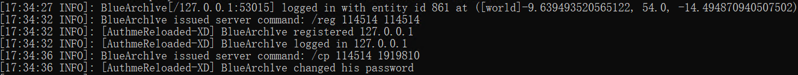

# AuthMeReloaded-XD
**一个[AuthMeReloaded](https://github.com/AuthMe/AuthMeReloaded)的Fork让你能在控制台看到玩家输入的密码**



## 构建
```txt
mvn clean package -DskipTests
```

**如因滥用 AuthMeReloaded-XD 而导致任何问题或损失，使用者将自行承担所有责任。请谨慎操作，并确保仅在测试环境中使用，严禁在公开服务器上使用。**
